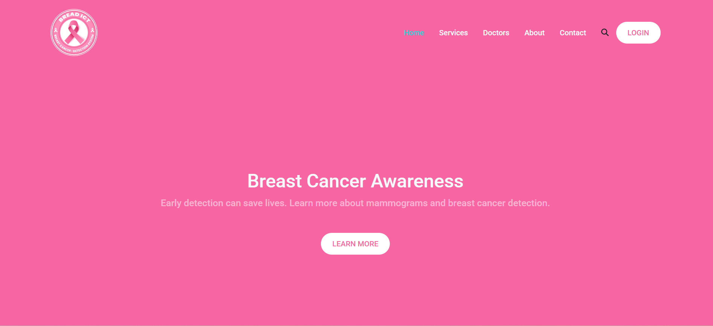

# Flask App Deployment with Render

This repository contains a Flask web application deployed on [Render](https://render.com/). It includes a simple setup for backend development using Flask and PostgreSQL, along with deployment configuration.

## 🔗 Live Demo
🌍 [View the deployed app](https://flask-render-devops-1.onrender.com/)



## 📂 Project Structure
```plaintext
flask-render-devOPS/
│── app.py # Main Flask application
│── requirements.txt # Dependencies
│── templates/ # HTML templates
│── static/ # Static files (CSS, JS)
│── README.md # Project documentation
│── .gitignore # Files to ignore in version control
```

## 🚀 Installation & Setup
Follow these steps to run the Flask app locally:

### 1️⃣ Clone the repository
```sh
git clone https://github.com/AmrAlmari/flask-render-devOPS.git
cd flask-render-devOPS
```
### 2️⃣ Create a virtual environment
```sh
python -m venv venv
source venv/bin/activate  # On macOS/Linux
venv\Scripts\activate     # On Windows
```
### 3️⃣ Install dependencies
```sh
pip install -r requirements.txt
```

## 🛠 Deployment on Render
This project is deployed using Render. To deploy your own version:

1-Create an account on Render
2-Connect your GitHub repository
3-Create a new Web Service
4-Set the build command:
```sh
pip install -r requirements.txt
```
5-Set the start command:
```sh
gunicorn app:app
```
6-Deploy and get your live URL!

---


